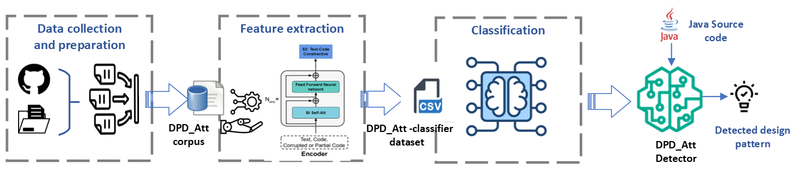

# Attention Based Method For Design Pattern Detection

This repository implements our paper <b>Attention-based Method for Design Pattern Detection</b>

* DPD_Att.rar : Represents the Java code that was used to create the dataset.
* DPD_Att_Classifier.csv : This is th data bassed to the classifier.
* DPD_F.csv : Contains the list of available files in the DPD_F dataset.
* DPD_F_Comparison.csv : This file contains embedding of files that (Patterns) that are covered by the DPD_F dataset.
* FLOPs_in_Figs_DPD_Att.ipynb: This file vizualizes FLOPs 
* Run_Computation_DPD.py : This file claculates the FLOPs
* complexity_DPD_Att.csv : This file contains the variations of FLOPs of the encoder on the DPD_Att_Classifier.csv dataset.
* cross valid : This script performs corss validation and experiments with differnt K values.
* datasetcreator.py : This script is responsible on creating the DPD_Att_Classifier.csv file, which represents the dataset passed to the classifier.
* embeddings.py : This script is used to communicate with encoder model. It contains two methods. One that calulcates the number of tokens in a given Java class. and another function that extracts features from a given Java class.
* model_t5p_300_Run.ipynb : This is the training and testing of the classifier on DPD_Att_Classifier.csv with embedding size equal to 300
* model_t5p_compare.ipynb : Comparision with state-of-the-art.
* codet5p : Contains encoder that we used for the feature extraction process.

### This approach is evaluated using four different statistical metrics (Precision, Recall, Harmonic-mean, Accuracy). 
FLOPs are also calculated on the DPD_Att dataset.
