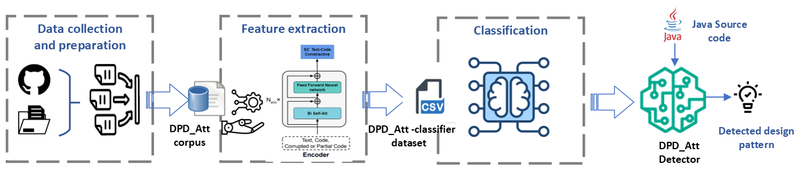
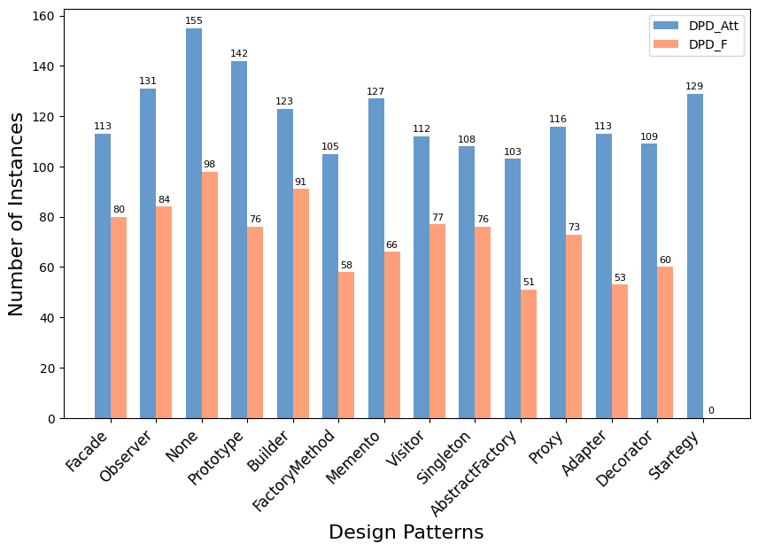
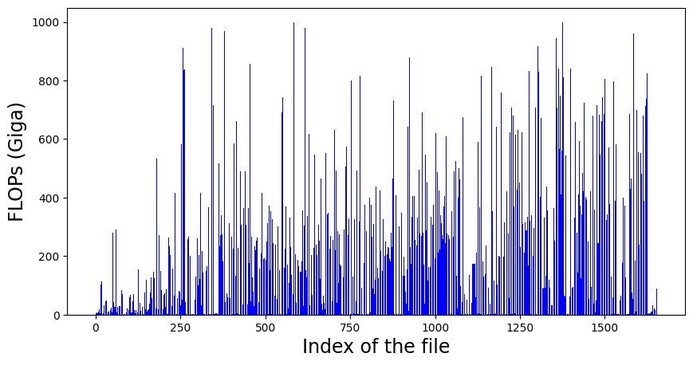
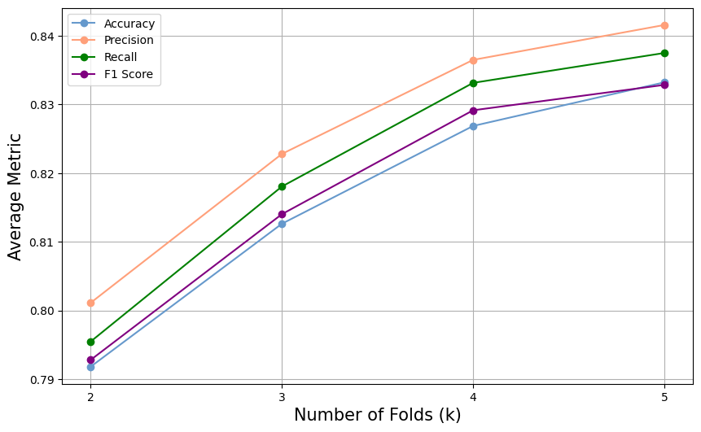

# Attention Based Method For Design Pattern Detection

GoF design patterns are a set of recurring solutions to common software design problems in object-oriented programming. These patterns were first introduced in the book "Design Patterns: Elements of Reusable Object-Oriented Software" by Erich Gamma, Richard Helm, Ralph Johnson, and John Vlissides, often referred to as the Gang of Four. The book categorizes these patterns into three main types: creational, structural, and behavioral. Creational patterns focus on object creation mechanisms, helping to create objects in a manner suitable to the situation. Structural patterns deal with the composition of classes or objects to form larger structures. Behavioral patterns focus on communication between objects, defining how objects interact and fulfill a given task. Each pattern addresses a specific design challenge in a reusable and flexible way, promoting code reusability, maintainability, and scalability in software development


This repository implements our paper <b>Attention-based Method for Design Pattern Detection</b>


* DPD_Att.rar : Represents the Java code that was used to create the dataset.
  Here's a representation of the data we have collected with respect to the dataset DPD_F provided by state-of-the-art.

  
* DPD_Att_Classifier.csv : This is th data bassed to the classifier.
* DPD_F.csv : Contains the list of available files in the DPD_F dataset.
* DPD_F_Comparison.csv : This file contains embedding of files that (Patterns) that are covered by the DPD_F dataset.
* FLOPs_in_Figs_DPD_Att.ipynb: This file vizualizes FLOPs
  Here's the variation of the number of floating point operations required by the model to compute the embedding vectors.

* Run_Computation_DPD.py : This file claculates the FLOPs
* complexity_DPD_Att.csv : This file contains the variations of FLOPs of the encoder on the DPD_Att_Classifier.csv dataset.
* cross valid : This script performs corss validation and experiments with differnt K values.

* datasetcreator.py : This script is responsible on creating the DPD_Att_Classifier.csv file, which represents the dataset passed to the classifier.
* embeddings.py : This script is used to communicate with encoder model. It contains two methods. One that calulcates the number of tokens in a given Java class. and another function that extracts features from a given Java class.
* model_t5p_300_Run.ipynb : This is the training and testing of the classifier on DPD_Att_Classifier.csv with embedding size equal to 300
* model_t5p_compare.ipynb : Comparision with state-of-the-art.
* codet5p : Contains the encoder that we used for the feature extraction process.


### This approach is evaluated using four different statistical metrics (Precision, Recall, Harmonic-mean, Accuracy). 


# Citation

If you use this project in your research work or publication, please cite it using the following BibTeX entry:

```bibtex
@misc{DP_Att,
  author = {Ilyes REZGUI, Rania MZID},
  title = {Attention Based Method For Design Pattern Detection},
  year = {2024},
  howpublished = {GitHub repository},
  url = {https://github.com/ilyesrezgui/Attention-based-Method-for-Design-Pattern-Detection},
}
